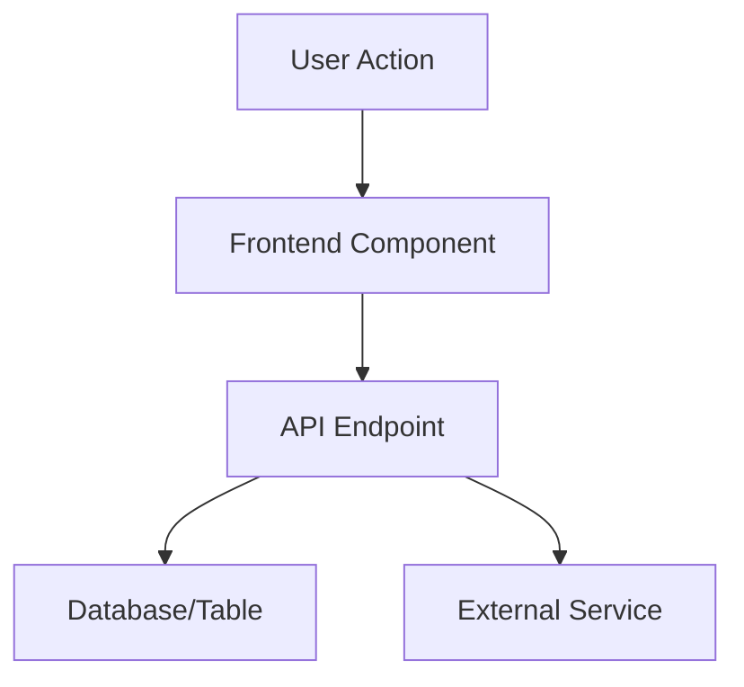

# Feature Specification: [[Feature Name]]

This document outlines the details for the feature `[[Feature Name]]`. Use this template to specify all relevant aspects of the feature, ensuring clarity and alignment across the development team. Update this document as the feature evolves.

---

## Basic Information

- **Feature ID**: [[Feature ID]]  
- **Status**: [[Planned/In Progress/Completed/Blocked/Deferred]]  
- **Owner**: [[Owner Name or Team]]  
- **Last Updated**: [[Date]]

---

## Description

### Overview

[[Provide a high-level summary of the feature, its purpose, and how it aligns with project goals.]]

### Scope

- **In-Scope**: [[Clearly define the boundaries of the feature. What will be included?]]  
- **Out-of-Scope**: [[Define what is explicitly not included in this feature to avoid scope creep.]]

### Related Features

- [Feature ID-002](./feature-id-002-messaging.md): Messaging functionality required for integration.
- [Feature ID-005](./feature-id-005-notifications.md): Notifications linked to user activity.

---

## User Stories

### Overview

This section defines the user stories for the feature, describing the functionality from the user's perspective.

#### User Stories Table

| User Story ID | Description                          | Priority  |
|---------------|--------------------------------------|-----------|
| [[US-001]]    | [[As a user, I want to...]]          | [[High]]  |
| [[US-002]]    | [[As a user, I need to...]]          | [[Medium]]|

#### User Story Details

1. **US-001**:  
   - **Description**: [[As a user, I want to...]]  
   - **Acceptance Criteria**:  
     - [[Criteria 1]]  
     - [[Criteria 2]]  

2. **US-002**:  
   - **Description**: [[As a user, I need to...]]  
   - **Acceptance Criteria**:  
     - [[Criteria 1]]  
     - [[Criteria 2]]  

---

## Functional Requirements

### Main Functionality

[[List the primary functionalities of the feature in clear, concise points. Use bullets or numbered lists.]]

### Validation Rules

[[Describe any validation or business rules required for the feature. For example, "Passwords must be at least 8 characters."]]

### Edge Cases

[[List potential edge cases and how they should be handled.]]

---

## Design Details

### Technical Implementation

- **Frontend**: [[Describe how the feature will be implemented on the frontend. Include relevant components or UI considerations.]]  
- **Backend**: [[Describe backend implementation details, such as APIs, data models, or database schemas.]]  
- **Integration Points**: [[List any external systems, APIs, or services involved.]]  
- **Data Flow**:  
  [[Explain how data will flow through the system for this feature.]]

#### Diagram

Use a **Mermaid diagram** to represent the architecture, data flow, or process. Below is an example template:

## Dependencies and Risks

- Dependencies: [[List dependencies, such as other features, libraries, or third-party services.]]
- Risks: [[Identify potential risks, such as technical limitations or external dependencies. Propose mitigation strategies.]]

## Testing Plan

### Test Cases

| Test Case ID | Description                          | Input            | Expected Output      | Notes                   |
|--------------|--------------------------------------|------------------|----------------------|-------------------------|
| [[TC-001]]   | [[Test Case Description]]           | [[Input Values]] | [[Expected Result]]  | [[Additional Notes]]    |

### Testing Strategy

[[Describe how the feature will be tested, including manual testing, automated tests, and performance testing.]]

---

## Workflow and Updates

1. **Development Workflow**:
   - Ensure all updates adhere to `.cursorrules`.
   - Include the **Feature ID** in all commit messages (`[Feature ID(s): [[Feature ID]]]`).
2. **Documentation Updates**:
   - Update the [Feature List](./feature-list.md) to reflect the current status of the feature.
   - Document any changes to related user stories or technical details.

---

## Changelog

| Date       | Change Made                                | Made By     |
|------------|-------------------------------------------|-------------|
| [[Date]]   | Created initial feature specification      | [[Name]]    |
| [[Date]]   | Added validation rules                    | [[Name]]    |
| [[Date]]   | Updated status to "Completed"             | [[Name]]    |

---

**Reminder**: Keep this document up to date throughout the feature's lifecycle. If additional questions or challenges arise, document them for review by the team.
