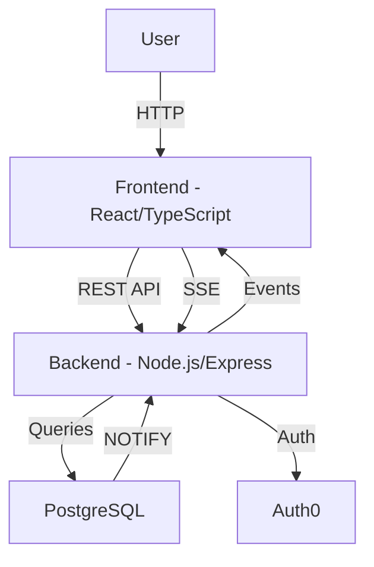

# Tech Stack and Architecture: ChatGenius

This document provides an overview of the technologies chosen for ChatGenius, the rationale behind these choices, and a high-level view of the system's architecture. It serves as a reference for developers and stakeholders to understand how the system is designed and how the components interact.

---

## Table of Contents

- [Tech Stack and Architecture: ChatGenius](#tech-stack-and-architecture-chatgenius)
  - [Table of Contents](#table-of-contents)
  - [Tech Stack Overview](#tech-stack-overview)
  - [Rationale for Technology Choices](#rationale-for-technology-choices)
    - [Frontend](#frontend)
    - [Backend](#backend)
    - [Realtime Communication](#realtime-communication)
    - [Database](#database)
    - [Authentication](#authentication)
    - [PWA and Offline Support](#pwa-and-offline-support)
  - [System Architecture](#system-architecture)
    - [High-Level Overview](#high-level-overview)
    - [Component Breakdown](#component-breakdown)
  - [Integration Points](#integration-points)
    - [External Services](#external-services)
    - [Core API Endpoints](#core-api-endpoints)
      - [Internal APIs](#internal-apis)
      - [Third-Party APIs](#third-party-apis)
    - [Core Types](#core-types)
    - [Sample API Endpoints](#sample-api-endpoints)
  - [Scalability and Performance Considerations](#scalability-and-performance-considerations)
    - [Offline Performance](#offline-performance)

---

## Tech Stack Overview

| Layer        | Technology                          | Purpose                                    |
|--------------|-------------------------------------|--------------------------------------------|
| Frontend     | React, TypeScript, MUI, Vite       | Type-safe, fast UI development            |
| State        | Redux Toolkit                      | Centralized state management              |
| Backend      | Node.js, TypeScript, Express       | Type-safe, efficient API handling         |
| Realtime     | Server-Sent Events (SSE)           | Real-time updates from server to client   |
| Database     | PostgreSQL                         | Robust relational data storage            |
| Auth         | Auth0                              | Secure, multi-provider authentication     |
| Testing      | Jest, React Testing Library        | Comprehensive test coverage               |
| Deployment   | Vercel                             | Zero-config deployment, edge functions    |
| PWA          | Service Workers, IndexedDB         | Offline support, native-like experience   |
| Storage      | Cache API, IndexedDB               | Offline data and file caching             |

---

## Rationale for Technology Choices

### Frontend

- **React**: Industry-standard library for building complex UIs, perfect for replicating Slack's interface
- **TypeScript**: Adds type safety, improving code quality and developer experience
- **MUI**: Provides customizable components that can be styled to match Slack exactly
- **Vite**: Offers superior development experience with instant HMR and optimized builds
- **Redux Toolkit**: Manages complex application state with built-in TypeScript support

### Backend

- **Node.js**: Efficient handling of concurrent connections, ideal for real-time features
- **TypeScript**: Ensures type safety across the full stack
- **Express**: Lightweight, flexible framework for REST API development

### Realtime Communication

- **Server-Sent Events (SSE)**:
  - Simpler than WebSocket for one-way server-to-client communication
  - Built-in reconnection handling
  - Works over HTTP, simplifying infrastructure
  - Native browser support

### Database

- **PostgreSQL**:
  - Robust ACID compliance
  - Rich querying capabilities
  - Excellent performance for complex joins
  - LISTEN/NOTIFY for real-time features

### Authentication

- **Auth0**:
  - Multiple authentication providers
  - Secure token handling
  - Easy integration with Express
  - Built-in security features

### PWA and Offline Support

- **Service Workers**:
  - Intercepts network requests
  - Manages cache strategies
  - Handles background sync
  - Enables push notifications

- **IndexedDB**:
  - Stores messages and reactions
  - Caches file metadata and content
  - Manages sync state
  - Handles offline operations

- **Cache API**:
  - Caches static assets
  - Stores file content
  - Manages storage quotas
  - Implements cleanup policies

---

## System Architecture

### High-Level Overview

The system follows a client-server architecture, with a focus on real-time communication. Below is a high-level depiction of the system’s architecture:



### Component Breakdown

1. **Frontend Layer**:
   - React components matching Slack's UI
   - Redux store for state management
   - SSE client for real-time updates
   - TypeScript for type safety
   - Service worker for offline support
   - IndexedDB for data persistence

2. **Backend Layer**:
   - Express REST API endpoints
   - SSE endpoint for real-time events
   - PostgreSQL connection pool
   - Auth0 integration

3. **Database Layer**:
   - User management
   - Channel/DM storage
   - Message history
   - File metadata
   - User preferences

4. **Real-time Updates**:
   - SSE for server-to-client updates
   - PostgreSQL NOTIFY/LISTEN for database events
   - Message delivery
   - Typing indicators
   - Presence updates

---

## Integration Points

### External Services

- **Auth0**: User authentication and session management
- **PostgreSQL**: Database hosting
- **Vercel**: Application hosting and deployment

### Core API Endpoints

#### Internal APIs

Define RESTful endpoints for CRUD operations on messages, channels, and users.

   ```typescript
   // Authentication
   POST /api/auth/login
   POST /api/auth/logout
   GET /api/auth/session

   // Channels
   GET /api/channels // List all accessible channels
   POST /api/channels // Create a channel
   GET /api/channels/:id // Get channel details
   PUT /api/channels/:id // Update channel
   DELETE /api/channels/:id // Archive channel
   GET /api/channels/:id/members // List channel members
   POST /api/channels/:id/members // Add member to channel
   DELETE /api/channels/:id/members/:userId // Remove member

   // Messages
   GET /api/channels/:id/messages // Get channel messages
   POST /api/channels/:id/messages // Send message
   PUT /api/messages/:id // Edit message
   DELETE /api/messages/:id // Delete message
   POST /api/messages/:id/reactions // Add reaction
   DELETE /api/messages/:id/reactions/:emoji // Remove reaction

   // Threads
   GET /api/messages/:id/thread // Get thread messages
   POST /api/messages/:id/thread // Reply in thread

   // Users
   GET /api/users // List users
   GET /api/users/:id // Get user profile
   PUT /api/users/:id // Update user profile
   GET /api/users/presence // Get online users
   PUT /api/users/status // Update user status

   // Real-time
   GET /api/events // SSE endpoint for all real-time updates

   // Files
   POST /api/files // Upload file
   GET /api/files/:id // Get file
   DELETE /api/files/:id // Delete file

   // PWA and Offline
   GET /api/sync/status // Get sync status
   POST /api/sync/channel/:id // Sync channel data
   POST /api/sync/files // Sync file data
   PUT /api/settings/offline // Update offline settings

   // Storage Management
   GET /api/storage/usage // Get storage usage
   POST /api/storage/cleanup // Clean up old data
   PUT /api/storage/preferences // Update storage preferences
   ```

#### Third-Party APIs

Currently integrated third-party services:

```typescript
// Auth0
GET  /api/auth/callback    // Auth0 callback handler
POST /api/auth/logout      // Auth0 logout

// File Storage (future implementation)
POST /api/files/upload     // Upload to cloud storage
GET  /api/files/download/:id // Download from cloud storage
```

### Core Types

```typescript
interface Message {
  id: string;
  channelId: string;
  userId: string;
  content: string;
  timestamp: string;
  edited: boolean;
  threadId?: string;
  reactions: {
    [emoji: string]: string[]; // Array of user IDs
  };
  files?: {
    id: string;
    name: string;
    type: string;
    url: string;
  }[];
}

interface Channel {
  id: string;
  name: string;
  type: 'public' | 'private' | 'dm';
  members: string[]; // Array of user IDs
  created: string;
  lastActivity: string;
  createdBy: string;
}

interface User {
  id: string;
  email: string;
  name: string;
  avatar?: string;
  status?: {
    text?: string;
    emoji?: string;
    expiry?: string;
  };
  presence: 'online' | 'away' | 'offline';
  preferences: {
    theme: 'light' | 'dark';
    notifications: NotificationSettings;
  };
}

interface NotificationSettings {
  desktop: boolean;
  email: boolean;
  keywords: string[];
  muteChannels: string[];
}

interface OfflineSettings {
  fileSyncDays: number;
  messageSyncDays: number;
  autoCleanup: boolean;
  storageLimit: number;
}

interface SyncState {
  channelId: string;
  lastSynced: string;
  syncType: 'messages' | 'files' | 'reactions';
  status: 'pending' | 'complete' | 'error';
  error?: string;
}

interface StorageUsage {
  total: number;
  messages: number;
  files: number;
  available: number;
  quota: number;
}
```

### Sample API Endpoints

**Endpoint**: `GET /api/auth/session`  
**Description**: Gets the current user's session information after Auth0 authentication.  
**Response**:

```json
{
  "user": {
    "id": "auth0|123456789",
    "email": "user@example.com",
    "name": "John Doe",
    "avatar": "https://example.com/avatar.jpg",
    "status": {
      "text": "In a meeting",
      "emoji": "📅",
      "expiry": "2024-01-10T15:00:00Z"
    },
    "presence": "online"
  },
  "expires": "2024-01-10T16:00:00Z"
}
```

---

## Scalability and Performance Considerations

1. **Database Optimization**:
   - Efficient indexing on frequently queried fields
   - Connection pooling for optimal resource usage
   - Regular VACUUM and maintenance
   - Partitioning for large tables (messages)

2. **Real-time Performance**:
   - SSE connection management
   - Event batching for bulk updates
   - Proper error handling and reconnection
   - Client-side message queuing

3. **Frontend Performance**:
   - Code splitting
   - Lazy loading of components
   - Efficient Redux state management
   - Optimistic UI updates

4. **Caching Strategy**:
   - Browser caching for static assets
   - Redis for API response caching (future)
   - Message history pagination
   - User presence caching

5. **Monitoring and Debugging**:
   - Error tracking with Sentry
   - Performance monitoring
   - API usage metrics
   - Real-time connection statistics

### Offline Performance

1. **Storage Management**:
   - Implement storage quotas
   - Auto-cleanup of old data
   - Prioritize recent content
   - Smart caching strategies

2. **Sync Efficiency**:
   - Incremental sync for messages
   - Delta updates for reactions
   - Chunked file downloads
   - Background sync queues

3. **Conflict Resolution**:
   - Last-write-wins for messages
   - Merge strategy for reactions
   - Queue for offline actions
   - Version tracking for edits
